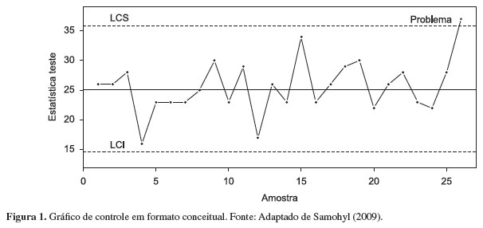
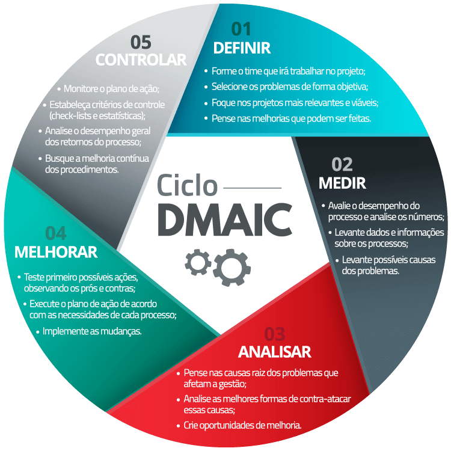
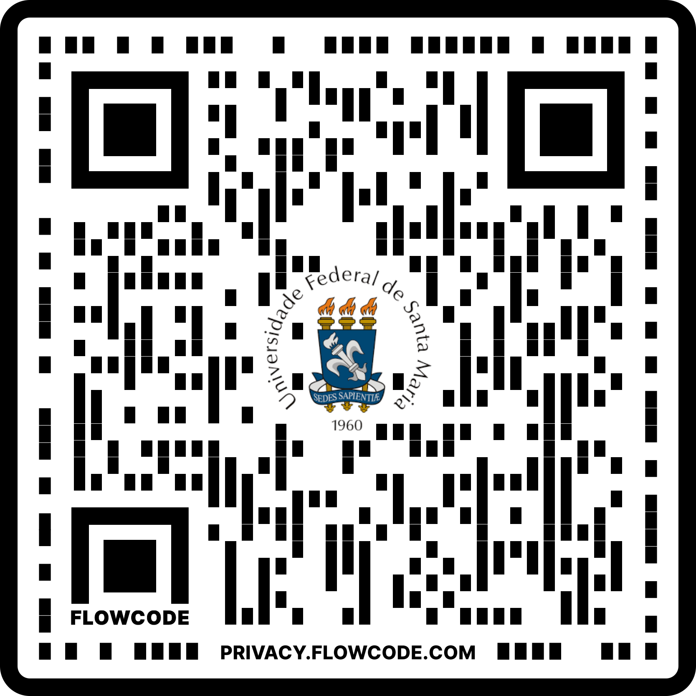

```{r setup, include=FALSE}
options(htmltools.dir.version = FALSE)
knitr::opts_chunk$set(
  fig.width=9, fig.height=3.5, fig.retina=3,
  out.width = "100%",
  cache = FALSE,
  echo = TRUE,
  message = FALSE, 
  warning = FALSE,
  hiline = TRUE
)
```

```{r xaringan-themer, include=FALSE, warning=FALSE}
library(xaringanthemer)
style_duo_accent(
  primary_color = "#035AA6",
  secondary_color = "#03A696",
  title_slide_background_image = ,
  text_slide_number_color = "#000"
  )
```

##Walter Shewhart

--

* **★** 18/03/1891, New Canton Illinois,EUA

* **†** 11/03/1967, Troy Hills, New Jersey, EUA

###Formação Acadêmica e Profissional
--

* **1913**: Formou-se em Física

* **1914**: Mudou-se para a Universidade da Califórnia

* **1917**: Obteve seu Ph.D. em Física pela Universidade Da Califórnia. Foi diretor de Física na escola Wisconsin Normal School

* **1918**: Ingressou no Departamento de Engenharia de Inspeção na Western Eletric Company

--


     
---
##Vida e Contexto

--

* Físico, engenheiro e estatístico conhecido como o **"pai do controle estatístico de qualidade"**

* Trabalhou como engenheiro na **Western Eletric Company**, empresa no ramo da engenharia elétrica e produção

* Trabalhou como estatístico nos laboratórios da **Bell Telephones**, empresa de pesquisa industrial e desenvolvimento científico

* Consultor do Departamento de Guerra Americano, das Nações Unidas e do Governo Indiano

* Lecionou nas universidades de Harvard, Rutgers e Princeton

* Introduziu a **estatística ao processo de garantia da qualidade**, tornando-o completo

* Seu trabalho serviu de **fundamento para pesquisas futuras** que geraram grandes avanços na produção. Ex: Edward Deming

---
##Honras

--

* Membro fundador, bolsista e presidente do **Instituto de Estatística Matemática**

* Membro fundador, primeiro membro honorário e primeiro a ganhar a Medalha Shewhart da ***American Society for Quality**

* Membro e Presidente da **American Statistical Association**

* Membro do International **Statistical Institute**

* Membro honorário da **Royal Statistical Society**

* Medalha Holley da **American Society of Mechanical Engineers**

* Doutor Honorário em Ciências, **Indian Statistical Institute** , Calcutá

---
##Carreira

--

**Western Eletric Company**

_"Pai do Controle Estatístico de Qualidade"_
  * Processos de controles estatísticos industriais
  * Aplicações para processo de medição na ciência
  * As técnicas de gráficos de controle
  
##Contribuições

--

**Redução da Variação - Gestão de Qualidade**
  * Fabricação mais precisa
  * Cartas de Controle (Causas de Variação)
  * Evitou peças defeituosas
--

     
---

**Controle Estatístico de Processos** 
* Uso de técnicas estatísticas para controle de processo
* Monitorar processos, identificar problemas internos e encontrar soluções para tais
* Sua ferramenta é o Gráfico de Controle
--

<p align="center"></p>

--

**Ciclo de Shewhart (ou PDCA)**
* Plan - Planejar a mudança
* Do - Estudar e testar a mudança
* Check - Revise os estudos
* Act - Agir com base no estudo/ Novas melhorias
--


  
---
**Six Sigma**
* Muitos laboratórios clínicos adotaram os conceitos estatísticos de Shewhart
* Redução de erros no processo com base no estudo do desvio padrão
* Indústrias redescobriaram as ferramentas de controle de processo estatístico de Shewhart
  e geraram o Six Sigma
* Definir - Mensurar - Analisar - Incrementar - Controlar

--


     
---
##Referências

RAMOS, Davidson. Gurus da Qualidade: Walter Shewhart. Blog da Qualidade, 16 de mar. de 2017. Disponível em <https://blogdaqualidade.com.br/gurus-da-qualidade-walter-shewhart/>. Acesso em 16 de mai. de 2022.

J.J, O’Connor e E F, Robertson. Walter Andrew Shewhart. MacTutor, University of St. Andrews, 6 de nov. de 2006. Disponivel em <https://mathshistory.st-andrews.ac.uk/Biographies/Shewhart/>. Acesso em 16 de mai. de 2022.
Walter A. Shewhart. Stringfixer, data não especificadada. Disponivel em <https://stringfixer.com/pt/Walter_A._Shewhart>. Acesso em 16 de mai. de 2022.

Walter A. Shewhart. Wikiwand, data não especificada. Disponivel em <https://www.wikiwand.com/pt/Walter_A._Shewhart>. Acesso em 17 de mai. de 2022.

MATTOSINHO, Luís Paulo. Gurus da Qualidade Total: conheça 8 grandes nomes e aprenda com eles. Cae Treinamentos, 2 de abr, de 2019. Disponivel em <https://caetreinamentos.com.br/blog/qualidade/gurus-da-qualidade-total/>. Acesso em 16 de mai. de 2022

FEMITHA, Ayshathul. Walter A. Shewhart. Slideshare, 2 de mar. 2020. Disponivel em <https://pt.slideshare.net/FemithaMa/walter-a-shewhart?from_action=save>. Acesso em 16 de mai. de 2022

---
##__

EQUIPE FORLOGIC. O que é PDCA?, Blog da Qualidade, 25 de jul. de 2018. Disponivel em <https://blogdaqualidade.com.br/o-que-e-pdca/>. 16 de mai. de 2022

GRACIA, Luciano. O que é 6-sigma?, Governo de Goias. Disponivel em <http://www.sgc.goias.gov.br/upload/arquivos/2013-07/o-que-e-6-sigma.pdf>.
EDEAVOR. Como o Seis Sigma pode ajudar sua empresa a alcançar a excelência, Endeavor, 11 de jun. 2015. Disponivel em <https://endeavor.org.br/estrategia-e-gestao/seis-sigma/>.

GRUPO FORLOGIC. Controle Estatistico de Processo, Ferramentas da Qualidade, 9 de nov. de 2016. Disponivel em <https://ferramentasdaqualidade.org/controle-estatistico-de-processo/>.

---
# Relatório

Link para PDF [aqui](https://flowcode.com/p/1D1YEUp1w)
<p align="center"></p>